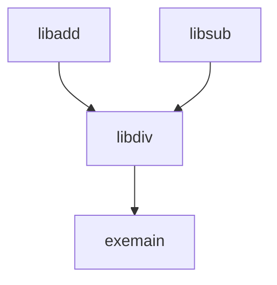

# testcmake
cmake子项目包含测试

# 结构

```
  ├── libadd
  │     ├── CMakeLists.txt
  │     ├── add.cpp
  │     └── add.hpp
  ├── libsub
  │     ├── CMakeLists.txt
  │     ├── inc
  │     │     └── sub.hpp
  │     ├── src
  │     │     └── sub.cpp
  ├── libdiv
  │     ├── CMakeLists.txt
  │     ├── div.cpp
  │     └── div.hpp
  └── exemain
        ├── CMakeLists.txt
        └── main.cpp
```

# 参考链接
[modern cmake](https://modern-cmake-cn.github.io/Modern-CMake-zh_CN/)  
[Modern CMake is like inheritance](https://kubasejdak.com/modern-cmake-is-like-inheritance)  
[CMake: Public VS Private VS Interface](https://leimao.github.io/blog/CMake-Public-Private-Interface/)  
[CMAKE 里PRIVATE、PUBLIC、INTERFACE属性示例详解](https://blog.csdn.net/weixin_43862847/article/details/119762230)  
["undefined reference to" 问题解决方法](https://blog.csdn.net/aiwoziji13/article/details/7330333)  
[CMake的链接选项：PRIVATE，INTERFACE，PUBLIC](https://zhuanlan.zhihu.com/p/493493849)  
